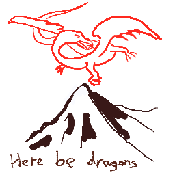

# HERRE THERE BE DRAGONS.

this is a working doc to figure out exactly what i'm trying to do

### memory

everything is stored in localstorage through the `getMemory` && `setMemory` functions. this needs to change. all the pulling and pushing (a couple places are n^2 or worse) from localstorage is slowing down the redraws. There are a couple things I want to do about this.

- [ ] clicks on the current layer should save to storage on mouseup, but not on mousedown
  - redraw should be updated to draw from memory + the unstored clicks of a current mouse movement
  - handle race condition where someone tries to undo while drawing (????)
    - other option is to just lose data & throw an alert that says '🏎🏁'
    - how am i this tired already?
- [x] mousemoves shouldn't redraw the whole canvas. if the following is true, it's quicker to just draw in the moment:
  - shift isn't pressed, and wasn't pressed during the last mouse movement
  - i'm picking up a mousedown, mousemove, or mouseup event

ok, so quick update. i just tested localstorage loading and saving. it's crazy fast. it's totally not the bottleneck even with those super unoptimized calls. this means the route to fixing the lag is optimizing redraws. don't redraw every mouse movement. just do it on mouseup, shift, or tool use

done with the optimizing. it doesn't lag anymore on any of the platforms i'm testing on

### tools available

i've got color, but it'd be nice to have a color history. tbh it's 4am and i'm crazy tired. i'll just list the features and figure out where to go from there.

- [ ] color swapping (ie photoshop's 2 random-access-colors)
- [ ] auto file upload
- [ ] timer (thinking i pull time from airtable & the timer is hiddable by clicking on it)
- [ ] url param setting of variables (ie. for this theme you have to use the following hex color provided by the link)

---

- [ ] see tool size on draw
- [ ] blur full renders, draw current renders on second canvas layer
- [ ] background color